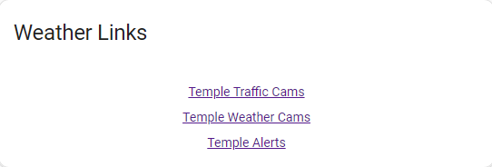

# Files Card by [@versile2](https://www.github.com/versile2) 
Modeled from [@iantrich](https://www.github.com/iantrich)'s List card. Additions originally submitted to the list-cards repository but have not received a response.

This card is for [Lovelace](https://www.home-assistant.io/lovelace) on [Home Assistant](https://www.home-assistant.io/) that gives you a datagrid generated with data from the [feedparser custom component](https://github.com/custom-components/sensor.feedparser) or any other sensor that provides data as a list of attributes. It also displays files from the folder integration and any other sensor attribute with JSON data. It also allows copy/paste of data. I don't use any feed sensors myself but that functionality was in the original list-card and I chose not to alter it.

![Project Maintenance][maintenance-shield]

[![GitHub Issues][github-issues-badge]][github-issues]
[![Community Forum][forum-shield]][forum]

[![GitHub Activity][commits-count-shield]][commits]
[![GitHub Last Commit][github-shield]][commits]

[![License][license-shield]](LICENSE.md)
[](https://github.com/hacs/integration)

[Go to Installation Instructions](#Installation)

## Support
Hey dude! Help me out for a couple of :beers: or a :coffee:!

[](https://www.buymeacoffee.com/versile2)

Great resource for further filtering your feeds is [siftrss](https://siftrss.com/)

## Examples
From top to bottom: [feedparser](https://github.com/custom-components/sensor.feedparser) | [aftership](https://github.com/custom-components/sensor.aftership) | [untappd](https://github.com/custom-components/sensor.untapped) | [Folder Integration](https://www.home-assistant.io/integrations/folder/) | JSON Sensor - Example at end




## Options

| Name | Type | Requirement | Description
| ---- | ---- | ------- | -----------
| type | string | **Required** | `custom:list-card`
| entity | string | **Required** | The entity_id of the entity you want to show.
| feed_attribute | string | **Optional** | Attribute containing the feed
| title | string | **Optional** | Add a custom title to the card.
| row_limit | number | **Optional** | Limit the number of rows to display.
| sort | object | **Optional** | Sort the list by a specific column. [See sort options](#sort-object)
| show_header | boolean | **Optional** | Defaults to true, if false hides the header row on all data. Useful for 1 column dataset.
| columns | object | **Optional** | List of columns to display. [See column options](#column-object)
| tap_action | map | **Optional** | Tap action map [See action options](#action-options)
| hold_action | map | **Optional** | Hold action map [See action options](#action-options)
| double_tap_action | map | **Optional** | Double tap action map [See action options](#action-options)

## Column object

| Name | Type | Requirement | Description
| ---- | ---- | ------- | -----------
| title | string | **Required** | Column header to display.
| field | string | **Required** | key value of the entity that you wish to display.
| add_link | string | **Optional** | key value of entity that has the link property to use.
| type | string | **Optional** | options are `image` and `icon`. Default is `None`. **Only set this for images or icons, otherwise leave blank**
| style | object | **Optional** | CSS styles to apply to this column.
| width | string | **Optional** | If type is image, sets the width of the image. Default 70.
| height | string | **Optional** | If type is image, sets the width of the image. Default 90.
| regex | string | **Optional** | Regex string to apply to field.
| prefix | string | **Optional** | String to prefix to field.
| postfix | string | **Optional** | String to postfix to field.

* Note: If width **and** height are set to "auto", the image will not be resized. If width **or** height are set to "auto", the aspect ratio of the image will be maintained.

* Note: For the Folder Integration your feed_attribute is file_list and columns available are: path, name, filename, fullpath, and ext
  - Path is just the path to the file not including the filename (e.g. '/config/www/media/files/')
  - Name is the filename including extension or if the name matches the format YYYYMMDDHHmmSS.* it will translate it to human readable date/time in English. (e.g. 'snapshot.jpg or 'Mar 14, 2024, 3:12PM')
  - filename is the filename including extension (e.g. 'snapshot.jpg')
  - fullpath is the full path and filename (e.g. '/config/www/media/files/snapshot.jpg') when used in add_link it changes /config/www/ to /local/
  - ext is just the extension (e.g. 'jpg')

## Sort object

| Name | Type | Requirement | Description
| ---- | ---- | ------- | -----------
| value | string | **Required** | field to sort by from columns.
| reverse | boolean | **Optional** | Defaults to false, set to true to reverse the sort.

## Action options
| Name              | Type     | Default  | Supported options                                                        | Description                                                                                               |
| ----------------- | -------- | -------- | ------------------------------------------------------------------------ | --------------------------------------------------------------------------------------------------------- |
| `action`          | `string` | none | `call-service`, `navigate`, `fire-dom-event`        | Action to perform                                                                                         |
| `navigation_path` | `string` | none     | Eg: `/lovelace/0/`                                                       | Path to navigate to (e.g. `/lovelace/0/`) when action defined as navigate, note path has restrictions here as it must be a lovelace path and in the www folder. Use add_link  in columns for external navigation.                                 |
| `service`         | `string` | none     | Any service                                                              | Service to call (e.g. `media_player.media_play_pause`) when `action` defined as `call-service`            |
| `service_data`    | `map`    | none     | Any service data                                                         | Service data to include (e.g. `entity_id: media_player.bedroom`) when `action` defined as `call-service`. |


### Example Configuration

```yaml
type: custom:list-card
entity: sensor.engineering_feed
title: Engineering Feed
feed_attribute: entries
columns:
  - title: ''
    type: image
    add_link: link
    field: image
  - title: Title
    field: title
    style:
      - white-space: nowrap
  - title: Description
    field: description
```

From the folder integration (file_list attribute)
```yaml
type: custom:list-card
entity: sensor.driveway
feed_attribute: file_list
title: Driveway
columns:
  - title: File Name
    field: name
    style:
      - text-align: center
    add_link: fullpath
```

From a custom JSON sensor
```yaml
type: custom:list-card
entity: sensor.weather_links
feed_attribute: weather_links
title: Weather Links
show_header: false
columns:
  - title: Title
    field: title
    add_link: link
    style:
      - text-align: center
```

The sensor configuration in configuration.yaml (or an !include templates.yaml)
```yaml
sensor:
  - name: Weather Links
    unique_id: 7b803482-a0d9-41f1-bc9c-2314adc4a756
    icon: mdi:weather-cloudy-clock
    state: Valid
    attributes:
      weather_links: |-
        
        
        Temple Traffic Cams, https://www.weatherbug.com/traffic-cam/temple-tx-76504  
        Temple Weather Cams, https://www.weatherbug.com/weather-camera/temple-tx-76504
        Temple Alerts, https://www.weatherbug.com/alerts/temple-tx-76504
        
        
        
        [
          
          
            
            
              
              
              {{ comma() }} { "title": "{{ title }}", "link": "{{ link }}" }
            
          
        ]
        
        {{ data }}
```

## Installation

Add to [HACS](https://hacs.xyz) as a Custom Repo by clicking on CODE above and copy link. Paste into HACS Add Repository. 

[Troubleshooting](https://github.com/thomasloven/hass-config/wiki/Lovelace-Plugins)

[commits-count-shield]: https://img.shields.io/github/commit-activity/t/versile2/files-card?style=for-the-badge
[commits-pery-shield]: https://img.shields.io/github/commit-activity/y/versile2/files-card?style=for-the-badge
[commits]: https://github.com/versile2/files-card/commits/main
[discord]: https://discord.gg/2SVz9sPB
[forum-shield]: https://img.shields.io/badge/community-forum-brightgreen.svg?style=for-the-badge
[forum]: https://community.home-assistant.io/t/custom-component-rss-feed-parser/64637
[license-shield]: https://img.shields.io/github/license/custom-cards/list-card.svg?style=for-the-badge
[maintenance-shield]: https://img.shields.io/badge/Maintainer-V%20Johnson-blue?style=for-the-badge
[github-shield]: https://img.shields.io/gitea/last-commit/versile2/files-card/main?style=for-the-badge
[github-issues-badge]: https://img.shields.io/badge/Project-Issues-blue?style=for-the-badge
[github-issues]: https://github.com/versile2/files-card/issues
